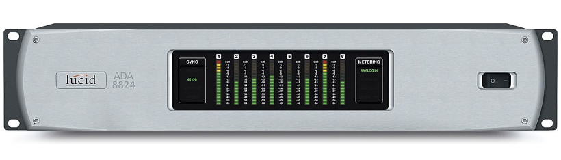
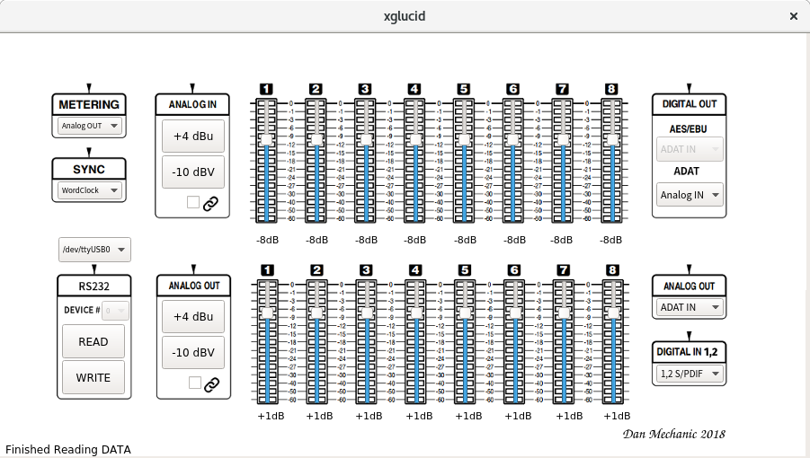

=======
 glucid
=======
	    

	    
**glucid**  is a python project to provide an api, a convenient
command-line interface and **xglucid**, a PyQt5 interface  to
configure RS232-model Lucid 8824 Analog/Digital Audio Converters
over a Serial Connection

**xglucid** GUI
===============

**glucid** Command Line
=======================
::

  $ glucid -g
  ----------------------------------------
  
  glucid and glucid8824.py:
  Copyright (C) 2017,2018 Daniel R Mechanic
  GPL version 3 ONLY <http://gnu.org/licenses/gpl.html>.
  This program comes with ABSOLUTELY NO WARRANTY;
  This is free software, and you are welcome to
  change and redistribute it under certain circumstances;
  For details see LICENSE
  ----------------------------------------
  Using /dev/ttyUSB0 to connect to lucid ID 00
  
  Sync:		        WordClock
  Meter:		Analog Out
  Analog Source:	ADAT In
  AES Source:	        ADAT In
  Optical Source:	Analog In
  Dig Input 1,2:	S/PDIF
  Analog Gain:
  
  ***************************************
  Recommended: +4dBu: IN -8 dB OUT  +1 dB
              -10dBV: IN +4 dB OUT -11 dB
  ***************************************
  
      Channel 1: IN -8 dB OUT  +1 dB
      Channel 2: IN -8 dB OUT  +1 dB
      Channel 3: IN -8 dB OUT  +1 dB
      Channel 4: IN -8 dB OUT  +1 dB
      Channel 5: IN -8 dB OUT  +1 dB
      Channel 6: IN -8 dB OUT  +1 dB
      Channel 7: IN -8 dB OUT  +1 dB
      Channel 8: IN -8 dB OUT  +1 dB
  

glucid Python Package
===================== 

  >>> import glucid.glucid8824 as glucid
  >>> my8824 = glucid.Glucid8824()
  >>> my8824.connect()
  True
  >>> my8824.get_meter()
  'Analog Out'
  >>> my8824.get_sync_source()
  '44.1 Internal'
  >>> my8824.set_sync_source(1)
  >>> my8824.get_sync_source()
  'WordClock'

Copyright (C) 2017,2018  Daniel R Mechanic (dan.mechanic@gmail.com)

Visit http://www.glucid.org for more information
