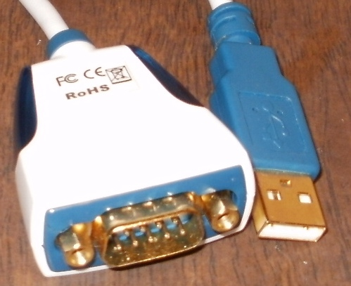

============
Installation
============

Requirements
============
**glucid** requires python >= 3 and:

* a serial port connected to a Lucid ADA8824 rs232 interface

   By default, **glucid** assumes you are using a USB to 9-pin serial adapter on linux and defaults to **/dev/ttyUSB0** , to overide this default, use the **-d** option.

Installing glucid via pip
=========================

glucid can installed via pip

.. code-block:: bash
		
   pip install glucid

   
Installing the latest version of glucid via git
===============================================

You can just clone the latest stable version of glucid via:

.. code-block:: bash

	git clone https://github.com/danmechanic/glucid.git

And then install from the cloned source via:

.. code-block:: bash

	cd glucid/
	pip install -e .

Verifying correct installation
------------------------------

Within a terminal, you can first verify basic installation with:

.. code-block:: bash

   glucid --help

In your Python distribution you may try to import the **glucid8824** module:

.. code-block:: Python

   from glucid import glucid8824

   
		

