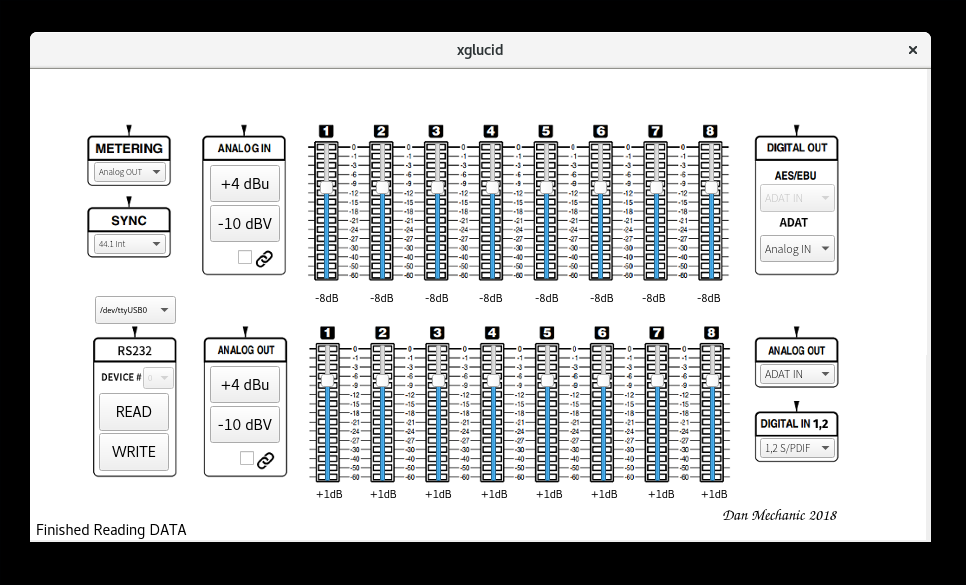

=========================
**xglucid** GUI Interface
=========================

.. note::
   xglucid requires Python 3, PyQt5 and PySerial
   
.. note::

   The user who is running glucid must be able to read
   and write to whichever serial device you are using; consult your
   operating system documentation.

.. note::

   xglucid assumes you are using /dev/ttyUSB0 a linux computer
   and a usb serial interface.   OSX users a recommended to try
   **/dev/tty.usbserial** for a usb to serial interface.  Windows
   users a recommended to try **COM1**.

.. note::

   Be sure to connect your serial interface **before starting xglucid**
   
First:

* Power Off your Lucid 8824
* Flip DIP Switch 1 on your Lucid 8824 to **down** and **power cycle your lucid** (remote)  **We recommend setting ALL DIP switches down and leaving them down for as long as you wish to keep your unit configured via software** 
* Connect a 9 pin Serial connector from the Lucid 8824 to your computer
* Power On your Lucid 8824

Launch **xglucid**
==================

.. ::code-block bash

   xglucid
   
Know what Serial Port you are Using
===================================

The default is /dev/ttyUSB0
---------------------------

By default, **glucid** assumes you are using **/dev/ttyUSB0**   Use the pulldown
menu to the left to select your Serial interface

Select **READ**
---------------

This will read all values from your ADA8824 and enable the options with
the values currently stored on your unit.

Write all Values wtih **WRITE**
-------------------------------

If you change any values, select **WRITE** to write them to your ADA8824.

Select **READ** to confirm your settings were written successfully.
